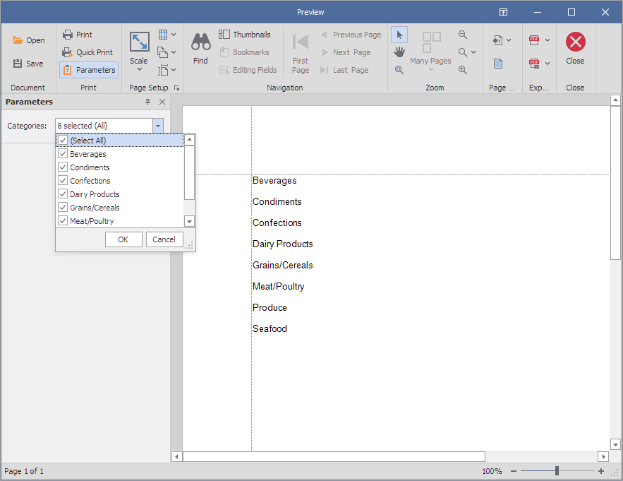

<!-- default badges list -->

<!-- default badges end -->
# Reporting for WinForms - Create a Multi-Value Report Parameter

This example shows how to create a multi-value report parameter with a list of predefined dynamic values, and how to use this parameter to filter the report data.

## Files to Review

* [Program.cs](./CS/Program.cs) (VB: [Program.vb](./VB/Program.vb))

## Documentation

* [Multi-Value Report Parameters](https://docs.devexpress.com/XtraReports/9998/detailed-guide-to-devexpress-reporting/use-report-parameters/multi-value-report-parameters)

## More Examples

* [Reporting for WinForms - Create a Date Range Report Parameter](https://github.com/DevExpress-Examples/reporting-winforms-parameter-daterange)
* [Reporting for WinForms - Add Parameters to Report at Runtime](https://github.com/DevExpress-Examples/reporting-winforms-add-report-parameters)
* [Reporting for WinForms - Implement a Custom Parameter Editor](https://github.com/DevExpress-Examples/reporting-winforms-implement-custom-parameter-editor)
<!-- feedback -->
## Does this example address your development requirements/objectives?

 

(you will be redirected to DevExpress.com to submit your response)
<!-- feedback end -->
